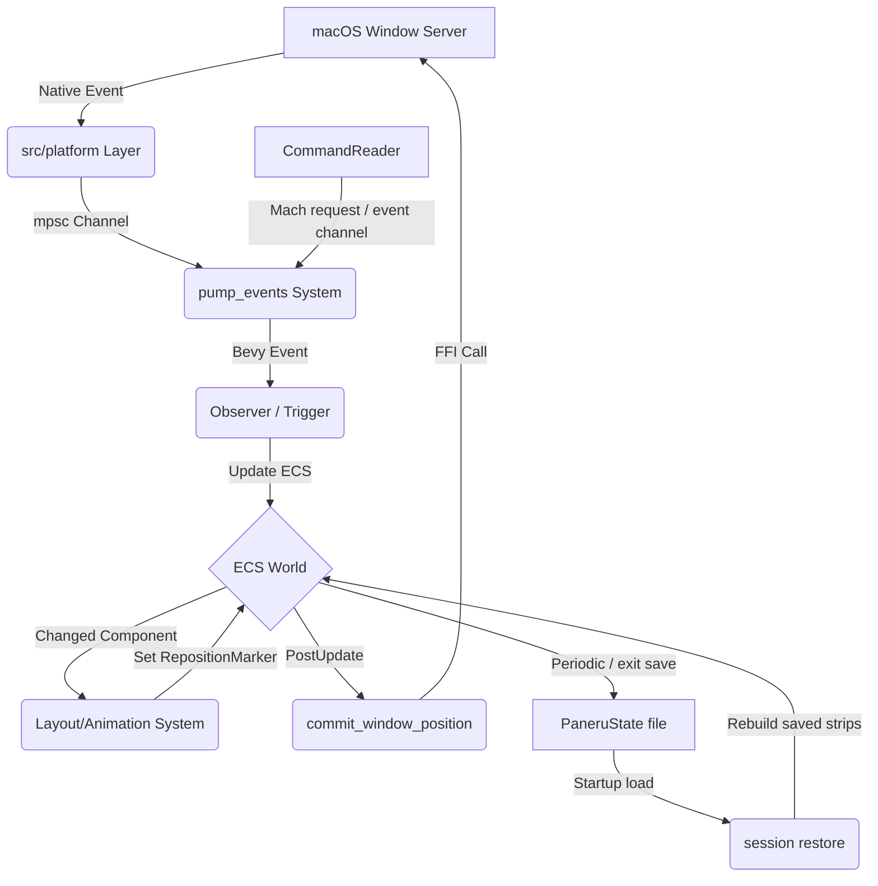

# Paneru Architecture

This document provides a high-level overview of Paneru's architecture for contributors. Paneru is a macOS window manager built using the **Bevy Game Engine** and its **Entity Component System (ECS)**.

## 1. High-Level Overview

Paneru manages macOS windows as a **sliding strip** (inspired by Niri and PaperWM). The core design philosophy is **Data-Driven/ECS**: instead of managing windows as complex objects with internal state, we represent the "World" as a collection of simple data components (Windows, Displays, Workspaces) that are processed by systems.

The primary problem Paneru solves is providing a predictable, stable, and ergonomic tiling experience on macOS. By using Bevy's ECS, we gain:
- **Declarative Logic:** Systems react to changes in window properties (e.g., `Changed<Position>`).
- **High Performance:** Parallel system execution and efficient change detection.
- **Modularity:** Functionality is divided into decoupled plugins and systems.

## 2. The Bevy Bridge

Bevy is typically used for games, so Paneru implements a custom bridge to interact with the macOS Window Server.

### Event Ingestion (macOS -> ECS)
1.  **Platform Layer:** `src/platform/` uses `objc2` and AppKit to interface with macOS. It runs a native event loop or hooks into OS notifications.
2.  **Event Channel:** macOS events (mouse moves, window creations, space changes) are sent via a thread-safe `mpsc` channel.
3.  **Pump System:** The `pump_events` system (in `src/ecs/systems.rs`) reads from this channel during the `PreUpdate` phase and writes Bevy `Message`s or triggers `Observer`s.
4.  **Observers:** Bevy Observers (primarily in `src/ecs/triggers.rs`, with focused domains such as session restore in `src/ecs/restore.rs`) react to these events to update the ECS World (e.g., spawning new `Window` entities or updating `FocusedMarker`).

### State Synchronization (ECS -> macOS)
1.  **Systems:** Bevy systems (like `layout::position_layout_windows`) calculate the intended positions and sizes of windows based on the tiling logic.
2.  **Commit Systems:** In the `PostUpdate` phase, specialized systems like `commit_window_position` and `commit_window_size` identify windows that need updating.
3.  **FFI Calls:** These systems call methods on the `Window` trait object (implemented by `WindowOS` in `src/manager/windows.rs`), which performs the actual accessibility API calls to move or resize the physical macOS window.

**Note:** All AppKit/Accessibility calls must happen on the **Main Thread**. Paneru ensures this by using `NonSend` resources and executing critical synchronization systems on the main thread.

### The Lua Worker (optional `lua` feature)

The embedded scripting runtime is the one deliberate exception to "everything interesting happens on the main thread". A handler is arbitrary user code of unbounded duration, and `pump_events` is itself main-thread-pinned, so running handlers inline meant a slow script stalled the frame clock. `src/lua/worker.rs` runs the interpreter on a dedicated thread instead:

- **Main → worker:** `dispatch_lua_events` and `command_lua_handler` extract plain data (`LuaEvent`, `StateSnapshot`) out of the world and send it over an unbounded channel. Neither ever blocks.
- **Worker → main:** `drain_lua_outbox` non-blockingly drains queued `Command`s and flash messages onto the command bus, one frame behind.
- **The query round-trip:** `paneru.query*` still reads the *live* world. The worker sends a request carrying a reply channel and blocks on it; `serve_lua_queries` answers it from `QueryStateParams` in `PreUpdate` (before the pump) and again in `PostUpdate`. Shutdown drops the request queue, which unblocks any waiting handler with an error rather than a hang.

This is what keeps `src/lua/runtime.rs` free of any `bevy` import: it reaches the world only through an `extract` callback, which on the main thread is a direct query and on the worker is that round-trip.

### Native Space Requests

Desktop creation and destruction and explicit window moves between native Spaces (`space create` / `space destroy` / `window spacemove` / `window spacesend`) cross the same boundary in the other direction, and the window server applies them asynchronously. The design keeps that asynchrony visible instead of papering over it:

- **Main-thread ABI bridge:** `src/manager/native_spaces.rs` drives the private SkyLight `WMBridge` operation objects. Every ABI is validated from the Objective-C method type encodings before a call, census reads fail closed on any structural surprise, and mutations run only on the process main thread in an unlocked console session. The module only *submits*: a failure after the first perform is reported as "may have applied", and the ID a synchronous create hands back is a receipt to confirm, not a confirmation.
- **Fresh Mission Control guard:** `src/platform/mission_control.rs` observes the current Dock and WindowManager owners through typed AX/CG data. Startup and failed observations are unknown, never inactive. Active/unknown states schedule fresh observations and owner subscriptions rebind after process replacement; known-inactive idle does not poll. The ECS guard and native submission boundary both refuse mutations unless inactivity is verified.
- **Destruction safety:** explicit migration refuses hidden application owners and attached window groups. Live macOS 27 testing found that the destroy bridge can leave these windows alive with no native Space; unhide the app or explicitly move the group first. Ownership/association reads fail closed, without guessing from on-screen status.
- **Small pending Components:** `src/ecs/native_spaces.rs` records each accepted request on its own entity or on the moving window (`NativeSpaceCreatePending`, `NativeSpaceDestroyPending`, `NativeSpacePlacementPending`, `SpaceMovePending`). One native request is in flight at a time; a new one is refused, not queued, while any of them is still being confirmed.
- **Asynchronous confirmation:** `Update` systems observe each pending on `Time` every `NATIVE_CHECK_INTERVAL` (50 ms) against a fresh Space census and per-window membership reads, bounded by `NATIVE_REQUEST_TIMEOUT` (2 s). The layout is rewritten only once the native state shows the request applied; a move is confirmed only when its whole batch (native tab group and associated windows) has landed.
- **All-member ownership:** `SpaceMovePending` separates every tracked native batch member from logical placement groups. Associated children keep independent slots and visibility/mode flags. All travellers are excluded from source focus and competing follower carries. If the leader closes, surviving members retain the original observation deadlines but not its focus intent.
- **Native tab identity:** `src/ecs/native_tabs.rs` reconciles fresh titlebar selection and uniquely resolved window identities, with bounded event-driven settling. Geometry is not identity. Previously established sibling identities can survive an inactive backing window remaining ordered in; first-time independent title matches cannot authorize a group. Every resolved tab is submitted explicitly and the initial native assignment is confirmed for the full batch. Unknown IDs refuse movement.
- **Native tab observation cost:** focus/title/lifecycle notifications observe promptly and retain their bounded retry deadline. Movement/resize echoes independently settle for 150 ms before observation, so ongoing panning neither rescans every frame nor starves a pending selection change. Each application observation shares one fresh, fully validated global window census across all member existence checks; native mutation preflight and confirmation still acquire their own fresh observations.
- **Native tab surfaces:** cached group selection and fresh native ordering guard AX geometry/raise writes on the main thread. A selection change replays the selected tiled window's desired geometry; inactive tab records remain logically present but not visible/focused.
- **Truthful partial results:** a request that fails or times out after submission is reconciled against what the window server actually reports rather than assumed unmoved, and is never treated as complete or resubmitted. What could not be observed keeps its last known layout; nothing is floated, rowed or focused by guess, and a failed census read says nothing either way.
- **Actual display ownership:** a new Desktop's row 0 is spawned under the display the census says owns it, never under the active display by assumption. The OS `SpaceCreated`/`SpaceDestroyed` notifications go through the same observers, so a Space the census cannot vouch for yet waits (bounded) instead of being placed by guess.
- **Change-driven cleanup:** a row a destroyed Space keeps for windows whose new Space was never observed is tagged `DestroyedSpaceMarker` and reaped by `reap_destroyed_space_rows` only when such a row is added or its `LayoutStrip` changes — never by a periodic scan.
- **Queryable uncertainty:** state and window-set extraction preserve unresolved windows in confirmed-destroyed rows as inactive, invisible and unfocused. They do not enumerate native occupancy for those rows; enumeration errors for present Spaces still propagate.

The public `send-cmd` path is fire-and-forget: an accepted dispatch is not native completion, and refused or partially applied requests are logged rather than surfaced to the client.

## 3. Crate & Module Map

| Directory / Module | Responsibility Statement |
| :--- | :--- |
| `src/ecs/layout.rs` | Tiling algorithms, column management, and coordinate calculations. |
| `src/ecs/systems.rs` | Bevy systems for lifecycle management, event pumping, and state syncing. |
| `src/ecs/params.rs` | High-level Bevy `SystemParam` abstractions for querying the World. |
| `src/ecs/triggers.rs` | Reactive event handlers (Observers) for OS and internal events. |
| `src/ecs/restore.rs` | Startup session restore planning and application, including window matching, layout rebuilding, and restore grace-period handling. |
| `src/ecs/workspace.rs` | Management of virtual workspaces, display changes, and window movement between spaces. |
| `src/ecs/scroll.rs` | Input handling for trackpad swipe gestures, inertia, and snapping. |
| `src/ecs/focus.rs` | Focus management logic, including focus-follows-mouse and mouse-follows-focus. |
| `src/ecs/state.rs` | Persistence of window layout and workspace state across restarts. |
| `src/ecs/native_spaces.rs` | Native Desktop creation/destruction and explicit `spacemove`/`spacesend` moves: submits one request per tick, records it on a pending component, and confirms it against the native census before touching the layout; also reconciles OS `SpaceCreated`/`SpaceDestroyed` notifications. |
| `src/manager/` | OS-agnostic traits (`WindowApi`, `ProcessApi`) and their macOS implementations (`WindowOS`). |
| `src/manager/native_spaces.rs` | The main-thread SkyLight `WMBridge` bridge: ABI-validated create/destroy/move/activate submissions, fail-closed Space census and window-membership reads, and the `paneru query native-spaces` census. |
| `src/platform/` | Low-level macOS FFI, event loop integration, and workspace/input hooks. |
| `src/config/` | Configuration parsing, validation, and hot-reloading logic. |
| `src/commands.rs` | Implementation of CLI subcommands. |
| `src/client.rs` | The CLI side of the IPC protocol, and the only place JSON is produced. |
| `src/reader.rs` | The daemon side: owns the Mach service and turns requests into events. |
| `crates/shared_types` | The wire protocol (`wire.rs`: `Request`, `Response`, `QueryPayload`), command and state types shared by the daemon, the CLI and the Lua crate. The transport itself is the external `async-mach-ports` crate. |
| `src/overlay.rs` | Logic for drawing active window borders and inactive window dimming. |

## 4. Key Data Entities

### Components
- **`Window`:** A wrapper around a macOS window handle (AXUIElement).
- **`Display`:** Represents a physical monitor and its bounds.
- **`LayoutStrip`:** A component attached to a Workspace/Display that manages the ordered list of `Column`s.
- **`LayoutPosition` / `Position`:** The intended (layout) vs. actual (on-screen) coordinates.
- **`Bounds` / `WidthRatio`:** The size of the window and its relative width in the tiling strip.
- **`FocusedMarker`:** Identifies the currently focused window.
- **`ActiveWorkspaceMarker`**: Identifies the currently active workspace.
- **`SelectedVirtualMarker`**: Marks a virtual workspace that is currently selected by the user.
- **`NativeFullscreenMarker`**: Marks a window that is in macOS native fullscreen mode.
- **`FloatingMarker`:** Persistent floating intent, independent of visibility.
- **`MinimizedMarker` / `HiddenMarker`:** Independent suspension flags; either excludes a window from layout and focus without changing its mode.
- **`PreviousManagedStrip`:** The tiled row to restore after suspension, used only while it still matches the window's native membership.
- **`NativeTabGroups` / `NativeTabsDirty`:** Application-scoped native identity and bounded outstanding observation work.
- **`RepositionMarker` / `ResizeMarker`**: Used to signal that a window needs to be moved or resized.
- **`NativeSpaceCreatePending` / `NativeSpaceDestroyPending` / `NativeSpacePlacementPending`:** One submitted or OS-announced native Space change awaiting census confirmation, each on its own entity.
- **`SpaceMovePending`:** An explicit native move's complete tracked membership, logical placement groups, and bounded confirmation phase; initially carried by its leader.
- **`DestroyedSpaceMarker`:** A row of a Space the census no longer lists, kept only for windows whose new Space was not observed; reaped once empty.

### Resources
- **`WindowManager`:** A wrapper for the global window management state and OS bridge.
- **`Config`:** The current user configuration.
- **`PaneruState`**: The durable snapshot of managed layout, display, native workspace, and virtual workspace state used for recovery after restarts.
- **`SessionRestore`**: A short-lived startup resource that keeps loaded state and restore timing active until the startup grace period expires.
- **`MissionControlActive`:** `Some(true)` for active, `Some(false)` for verified inactive, `None` for unknown. Active and unknown both block native mutations.
- **`FocusFollowsMouse`:** Tracks which window should gain focus based on mouse position.

## 5. Architectural Invariants

- **Main Thread Only:** Any interaction with `objc2`, `AppKit`, or `Accessibility` APIs **must** occur on the main thread.
- **ECS as Source of Truth:** Tiling logic must operate on ECS components (`WidthRatio`, `LayoutStrip`). The physical macOS window state should be a reflection of the ECS state, not the other way around.
- **Pure Layout:** Layout math (in `layout.rs`) should remain as pure as possible, operating on coordinates and ratios rather than directly calling OS APIs.
- **Bounded Restore:** Saved session state is only consulted during startup restore. After `SessionRestore` expires, normal config and window-rule placement owns newly discovered windows.
- **Reactive Power Saving:** Systems should use Bevy's reactive scheduling to avoid CPU usage when no windows are moving or events are occurring.
- **Native Requests Are Submissions:** A native Space create, destroy or move is confirmed from a later census or membership read, never from the submission's return value. Nothing is retried, rolled back, or laid out on the strength of an unobserved outcome.

## 6. Session Restore

`src/ecs/state.rs` extracts and persists the restart snapshot. The state file is
written atomically to `paneru/state.json` in the XDG state directory
(`~/.local/state/paneru/state.json` on a default macOS setup) and is loaded
during Bevy app setup.

`src/ecs/restore.rs` owns startup restore. It keeps the loaded `PaneruState`
alive in `SessionRestore` for the configured grace period so applications have
time to reopen their windows. As windows arrive, `restore_window_state` builds a
restore plan from the saved state and the currently managed ECS windows.

Window matching prefers stable identity (`window_id`, `pid`, and `bundle_id`)
and uses the conservative fallback identity only when it can do so
unambiguously. The fallback includes `bundle_id`, window title when available,
window identifier, role, and subrole. Saved windows that are missing at startup
are ignored by default, and the restored layout is compacted around the matched
windows.

Restore rebuilds `LayoutStrip`s, virtual workspace rows, selected virtual
workspace markers, and display associations. When the current macOS workspace
to display mapping conflicts with saved display data, the current mapping is
preferred; otherwise restore falls back to the saved display, then the active
display, then any available display. Matched startup windows skip static
`[windows]` placement so the saved session wins, while unmatched windows and
post-grace windows follow normal config behavior.

## 7. Data Flow Diagram

## 8. Testing Strategy

1.  **Pure Unit Tests:** Located in `src/tests.rs` and alongside modules. These test layout math and configuration parsing without requiring a macOS environment.
2.  **ECS Integration Tests:** Use Bevy's `App` or `World` to drive systems in isolation. macOS APIs are typically mocked via the `WindowApi` and `WindowManagerApi` traits.
3.  **Session Restore Tests:** `src/tests/session_restore.rs` covers restore planning, missing-window compaction, startup grace behavior, config precedence, virtual workspace restoration, and multi-display fallback.
4.  **Native Space Tests:** `src/tests/native_spaces.rs` drives creation, destruction and explicit moves against the mock window server's outcome controls and a manual clock: late, lost or refused confirmations, partial batches, follower interplay, multi-display ownership, and the bounded waits. Multi-display behavior is verified only here; live verification has covered ordinary single-display Desktops.
5.  **FFI Verification:** Manual or semi-automated tests on macOS to ensure the Accessibility API calls behave as expected with native windows.
6.  **Agent Support:** The `AGENTS.md` file provides project-specific guidance for AI agents to ensure contributions follow these architectural patterns.
